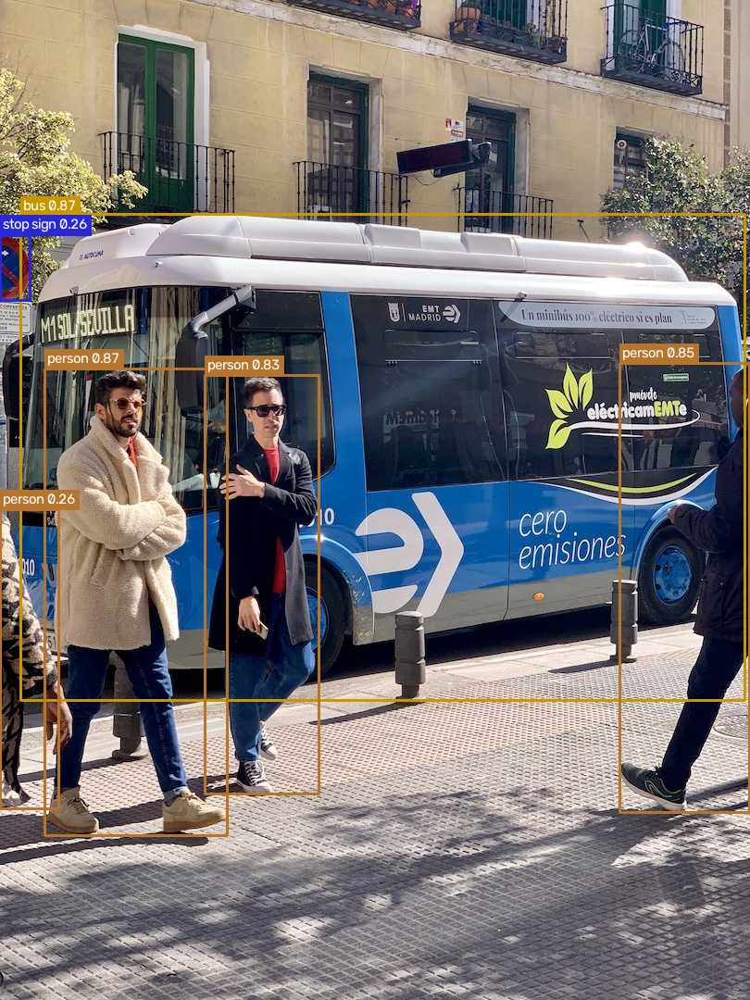

# 🔍 Object Detector


Detects objects in images and video using **YOLO** and **OpenCV**, and draws bounding boxes with class names and confidence scores.

## Demo



## Features

- Object detection on images (80 COCO classes with the default model)
- Bounding boxes with class names and confidence scores
- Adjustable confidence threshold (`--conf`)
- Annotated results saved to the `output/` folder
- Video files and webcam input (`--source 0`)

## Tech stack

- Python
- OpenCV
- YOLO

## Installation

```bash
git clone https://github.com/leonkrm/object-detector.git
cd object-detector
python -m venv .venv
source .venv/bin/activate      # Windows: .venv\Scripts\activate
pip install -r requirements.txt
```

## Usage

```bash
# image (your own photo)
python detect.py --source path/to/image.jpg

# higher confidence threshold
python detect.py --source path/to/image.jpg --conf 0.5

# video file
python detect.py --source path/to/video.mp4

# webcam (press q to quit)
python detect.py --source 0
```

Results are saved to the `output/` folder. Model weights (`yolov8n.pt`) are downloaded automatically on the first run.

| Option | Description | Default |
|---|---|---|
| `--source` | Image path, video path, or webcam index | required |
| `--model` | YOLO weights file | `yolov8n.pt` |
| `--conf` | Confidence threshold (0-1) | `0.25` |
| `--output` | Folder for results | `output` |
| `--show` | Show a window with the result | off |

## Project structure

```
object-detector/
├── detect.py          # entry point
├── requirements.txt
└── docs/              # screenshots and demo images
```

## How it works

1. A frame (or image) is loaded with OpenCV.
2. The YOLO model predicts bounding boxes, classes and confidence scores.
3. Low-confidence detections are filtered out.
4. Boxes and labels are drawn on the frame and saved or displayed.

## Roadmap

- [x] Detection on images
- [x] Confidence threshold as a CLI option
- [ ] Test and polish video and webcam modes
- [ ] Measure speed (FPS) on CPU and add results here
- [ ] Wrap the model in a REST API (FastAPI) and a Docker image
- [ ] Evaluate accuracy on a custom dataset

## Author

**Leon** · [GitHub](https://github.com/leonkrm) · [LinkedIn](https://www.linkedin.com/in/ruslan-kerimbekov/) · [Telegram](https://t.me/insomeli)